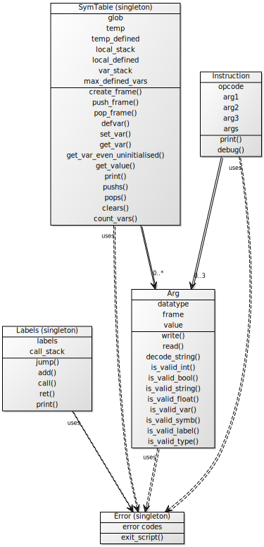

Implementační dokumentace k projektu do IPP 2018/2019

Jméno a příjmení: Jan Havlín

Login: xhavli47

# parse.php

## Popis skriptu
Skript slouží k ověření lexikální a syntaktické správnosti zdrojového kódu v jazyce IPPcode19 a následné převedení kódu do formátu XML.

## Vstupní parametry
Skript čte vstupní parametry z příkazového řádku pomocí funkce `getopt()`.

Parametr `-h` nebo `--help`	vypíše nápovědu ohledně spouštění skriptu a ukončí činnost.

Následující parametry patří k rozšíření **STATP**. Do výstupního souboru se statistiky vypisují dle pořadí parametrů na příkazovém řádku.

`--stats=soubor` Do *soubor* vypíše statistiky analýzy kódu dané následujícími parametry, tento parametr je nutný, pokud je zadán jeden z následujících parametrů:

`--loc` Do *soubor* vypíše počet instrukcí ve zdrojovém kódu,
`--comments` do *soubor* vypíše počet komentářů ve zdrojovém kódu,
`--labels` do *soubor* vypíše počet definovaných návěští,
`--jumps` do *soubor* vypíše počet skokových instrukcí (mezi ně se řadí `JUMP`, `JUMPIFEQ`, `JUMPIFNEQ`).

Skript ignoruje jiné parametry než zde uvedené. Duplicity statistických parametrů jsou ignorovány. Na pořadí parametrů nezáleží.

## Implementační detaily
Skript je napsán v jazyce **php7.3** metodou procedurálního programování. Pro výstup XML použita knihovna **SimpleXMLElement**.

## Lexikální a syntaktická analýza
Jelikož IPPcode19 se řadí mezi nestrukturované programovací jazyky, můžeme zdrojový kód analyzovat řádek po řádku. Po načtení řádku probíhá kontrola výskytu komentáře, kde se odstraní všechny znaky od prvního výskytu znaku `#`. Následně se řádek rozdělí do pole na operační kód a až 3 argumenty funkcí `preg_split()` podle výskytu libovolně dlouhé sekvence bílých znaků. Toto pole projde kontrolou, zdali obsahuje validní operační kód a správný počet a typy argumentů. V neposlední řadě se provede lexikální analýza nad jednotlivými argumenty instrukce. U literálů typu int se provádí lexikální kontrola, ačkoliv není povinná.

## Výstup skriptu
V případě, že analýza zdrojového souboru proběhla v pořádku, tiskne se na standardní výstup reprezentace zdrojového kódu ve formátu XML. V případě neúspěchu se nevytiskne nic.

## Rozšíření
V rámci skriptu je implementováno rozšíření **STATP**. Jeho chování a vstupní parametry je popsáno ve vstupních parametrech.

Implementační dokumentace k 2. úloze do IPP 2018/2019

Jméno a příjmení: Jan Havlín

Login: xhavli47

## Hodnocení

- Lexikální analýza: 97%

- Syntaktická analýza: 100%

- Zpracování instrukcí: 100%

- Zpracování programů: 90%

- Rozšíření STATP 84%

- Celkem bez rozšíření: 98%

# interpret.py

## Popis

Skript slouží k interpretaci zdrojového kódu v jazyce IPPcode19 ve formátu XML.

## Vstupní parametry

Interpret čte vstupní parametry z příkazového řádku pomocí modulu **argparse**.

Parametr `-h` nebo `--help`	vypíše nápovědu ohledně spouštění interpretu a ukončí činnost.

`--source=soubor` Ze *soubor* čte instrukce ve formátu XML. Pokud tento parametr není zadán, čte ze standardního vstupu.

`--input=soubor` Ze *soubor* čte vstup pro instrukce `READ`. Dochází k přesměrování standardního vstupu na stream tohoto souboru, aby bylo možné využít funkci `input()`. Pokud tento parametr není zadán, čte ze standardního vstupu. Alespoň jeden z parametrů `--source` nebo `--input` musí být zadán, jinak chyba.

`--debug` Vlastní parametr pro ladicí účely. Instrukce se krokují a vypisují na standardní výstup.

Následující parametry patří k rozšíření **STATI**. Do výstupního souboru se statistiky vypisují dle pořadí parametrů na příkazovém řádku.

`--stats=soubor` Do *soubor* vypíše statistiky dané následujícími dvěma parametry dle pořadí parametrů na příkazovém řádku.

`--vars` Vypíše maximální počet proměnných, které byly inicializovány po dobu běhu interpretu.

`--insts` Vypíše počet vykonaných instrukcí.

Skript ignoruje jiné parametry než zde uvedené. Na pořadí parametrů nezáleží.

## Implementační detaily

### XML vstup

Pro čtení XML vstupu použit modul **xml.dom**. Po načtení vstupu probíhá kontrola, zdali je XML dobře formátovaný (well-formed) a následně probíhají kontroly jeho obsahu, zda jednotlivé elementy obsahují správný počet atributů, neobsahují text navíc, instrukce se seřadí vzestupně dle atributu `order` a zkontroluje se správnost posloupnosti atributů `order` (začínají od 1, nesmí se vyskytnout duplicita, nesmí se přeskočit číslo).

### Interpretace

Samotná interpretace se provádí dvěma průchody. V prvním průchodu se pouze zadefinují návěští (instrukce `LABEL`). V druhém průchodu se interpretují všechny zbylé instrukce.

Tato dvouprůchodová interpretace je neefektivní, jelikož při načtení každé instrukce dochází k lexikálním a syntaktickým kontrolám jejich hodnot. Toto se projevuje rovněž při opakování úseků kódu pomocí skokových instrukcí.

### Diagram tříd

## Rozšíření
V rámci interpretu jsou implementovány rozšíření **FLOAT**, **STACK** a **STATI**.

Pro hodnoty typu float se neprovádí lexikální kontrola hexadecimálního zápisu, předpokládá se tedy, že tyto hodnoty jsou zadány správně. S hodnotami typu float lze pracovat stejně jako s hodnotami typu int, string, bool, lze je tedy načítat pomocí instrukce `READ`

## Hodnocení

- Lexikální analýza: 94%

- Syntaktická analýza: 100%

- Sémantická analýza (detekce chyb): 100%

- Běhové chyby (detekce): 100%

- Interpretace instrukcí: 98%

- Interpretace programů: 33%

- Rozšíření FLOAT 82%

- Rozšíření STACK 88%

- Rozšíření STATI 47%

- Celkem bez rozšíření: 86%

# test.php

## Popis

Skript testující skripty **parse.php** a **interpret.py**. Na vstup zadává zdrojové kódy pro daný skript a porovnává, zdali se výstupy rovnají s referenčními.  

## Vstupní parametry

Skript čte vstupní parametry z příkazového řádku pomocí funkce `getopt()`.

Parametr `-h` nebo `--help`	vypíše nápovědu ohledně spouštění skriptu a ukončí činnost.

`--directory=cesta` Vyhledá testovací soubory v adresáří *cesta*.

`--recursive` V adresáři *cesta* rekurzivně vyhledá testy v podadresářích.

`--parse-script=file` Soubor *file* je skript **parse.php**. Pokud není tento parametr zadán, skript se vezme z aktuálního adresáře. 

`--int-script=file` Soubor *file* je skript **interpret.py**. Pokud není tento parametr zadán, skript se vezme z aktuálního adresáře.

`--parse-only` Bude testován pouze skript **parse.php**. Tento parametr nelze kombinovat s parametrem `--int-only`.

`--int-only` Bude testován pouze skript **interpret.py**. Tento parametr nelze kombinovat s parametrem `--parse-only`.

`--xml=file` Vlastní parametr umožňující změnit cestu k nástroji **JExamXML**. Pokud není tento parametr zadán, použije se cesta dle serveru **Merlin**.

## Implementační detaily

Skript je napsán v jazyce **php7.3** metodou procedurálního programování.

V prvním kroku se analyzují vstupní parametry funkcí `getopt()`. Dále se získá seznam vstupních testů, pro nerekurzivní vyhledávání slouží funkce `glob()`, pro rekurzivní vyhledávání použita třída `RecursiveDirectoryIterator`.

Pro každý testovací soubor ze seznamu se spustí jedna z funkcí `test_parse()`, `test_int()`, nebo `test_both()` dle vstupních parametrů.

Funkce `test_parse()` nejprve spustí skript **parse.php** a jeho výstup porovná s referenčním návratovým kódem a XML výstup porovná pomocí nástroje **JExamXML**

Obdobně funkce `test_int()` spustí interpret **interpret.py** a porovná jeho výstupy.

Funkce `test_int()` spustí skript **parse.php**, jeho výstup, pokud skončil úspěšně, zadá skriptu **interpret.py** a výstupy porovná s referenčními.

Tyto testovací funkce vytváří dočasné soubory pro účel porovnání výstupu skriptu a pro zadání výstupu na vstup dalšího skriptu.

## HTML Výstup

HTML kód ohledně úspěšnosti testů se průběžně ukládá do proměnné `$html` a před ukončením **test.php** se vypíše na standardní výstup. Jednotlivé testy jsou rozděleny do skupin dle adresářů, každá skupina adresářů obsahuje v hlavičce procentuální úspěšnost testů adresáře. Jednotlivé testy obsahují informace o názvu testu, zdali test celkově dopadl úspěšně, zdali byl správný návratový kód a výstup skriptu. Pokud selhalo porovnání návratového kódu nebo výstupu, vypíše se získaný a očekávaný výstup. 
